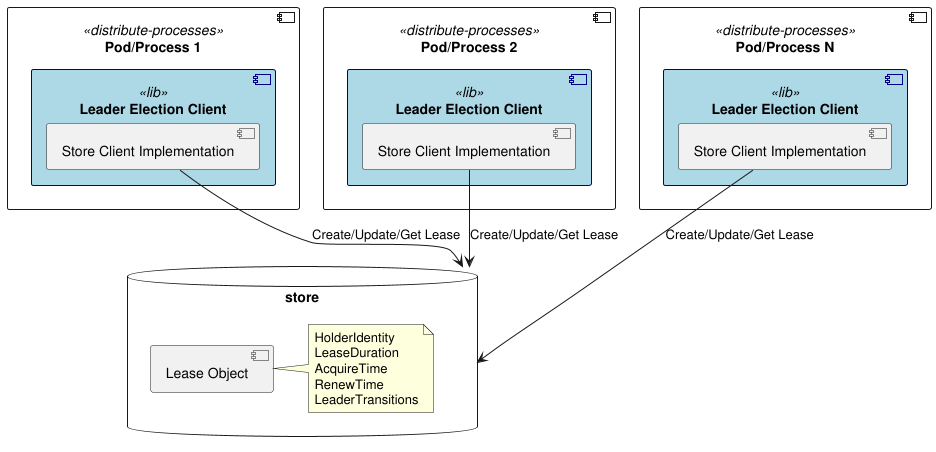

## Leader Election with Leases: A High-Level Overview

This library is heavily inspired by the [Kubernetes leader election client-go](https://pkg.go.dev/k8s.io/client-go/tools/leaderelection) 
library. It provides a mechanism for leader election among a group of distributed processes. 

Kubernetes uses leader election extensively for components like the scheduler (`kube-scheduler`) and 
controller manager (`kube-controller-manager`).  Instead of each instance constantly vying for control, 
only *one* instance is active at a time, ensuring consistency and avoiding conflicts.  Leases provide a mechanism for implementing this.

This repository implements a very similar algorithm to the kubernetes version while abstracting away the 
lease-store interface. The main goal is to provide a simple and extendable way to implement leader election in 
Go applications with the ability to use different lease stores (e.g. redis, mongodb, postgres, memory-store, etc). 



Here's a high-level explanation of how it works:

1.  **The Goal: One Active Instance.** The primary goal is to have a single, actively working instance of a component (e.g., the scheduler) making decisions, while other instances are in standby, ready to take over if the leader fails.

2.  **The Lease Object (Coordination API).** The library uses a `Lease` object as a shared resource representing leadership.  Think of it like a digital "talking stick" or a lock.  Only one instance can "hold" the lease at any given time.

3.  **Key Lease Attributes:**  The `Lease` object contains crucial information:
    *   **Holder Identity:** Which instance currently "owns" the lease (e.g., "scheduler-pod-xyz").
    *   **Lease Duration:** How long the lease is valid for (e.g., 15 seconds).  This is a *timeout*.
    *   **Acquire Time:** When the lease was last acquired.
    *   **Renew Time:** When the lease was last renewed.
    *   **LeaderTransitions:** When the lease was last renewed.

4.  **The Election Process (Simplified):**

    *   **Contention:** Multiple instances (pods) of the component (e.g., multiple scheduler pods) simultaneously try to acquire the lease.
    *   **Acquire/Create:**
        *   **If the lease doesn't exist:**  The first instance to attempt a `Create` operation on the `Lease` object succeeds.  It becomes the leader and sets the `HolderIdentity`, `AcquireTime`, and `RenewTime`.
        *   **If the lease exists and is *expired*:**  An instance can try to `Update` the lease, essentially taking it over by updating the `HolderIdentity` and timestamps. Expiration is determined by `LeaseDuration` and `RenewTime`. `LeaderTransitions` is incremented.
        *   **If the lease exists and is *held* (not expired):** Attempts to `Update` the lease by a non-holder will fail. The current leader is still active.

    *   **Renewing the Lease (Heartbeat):**  The current leader *periodically* updates the `RenewTime` field of the lease object *before* the `LeaseDuration` expires. This "heartbeat" signals that the leader is still alive and functioning.  This is typically done well before the lease actually expires.

    *   **Leader Failure and Takeover:**
        *   If the leader *fails* to renew the lease (e.g., due to a crash, network partition), the `LeaseDuration` will eventually elapse.
        *   Other standby instances, which are also constantly trying to acquire/update the lease, will detect that the lease is now expired.
        *   One of the standby instances will successfully `Update` the lease, becoming the new leader.

    *   **Leader Shutdown:**
        * Using an appropriate configuration (`ReleaseOnCancel`), when the leader is gracefully shut down, it will release the lease, and another pod will take over before the `LeaseDuration`.

5.  **Why Leases are Effective:**

    *   **Exclusivity:** Only one instance can hold the lease at a time, ensuring a single active leader.
    *   **Fault Tolerance:** If the leader fails, the lease mechanism automatically allows another instance to take over quickly, minimizing downtime.  The `LeaseDuration` acts as a failure detection mechanism.
    *   **Simplicity:** The Algorithm is straightforward and well-tested by Kubernetes.
    *   **Avoids Split-Brain:** Ensures that there will never be more than one leader.


### Configuration

The library provides a simple configuration struct to set up the leader election process:

```go
// ElectorConfig holds the configuration for the Elector.
type ElectorConfig struct {
    // LeaseDuration is the duration that non-leader candidates will wait before
    // attempting to acquire the lease (trying to become leaders).
    LeaseDuration time.Duration
    // RetryPeriod is the duration the LeaderElector clients wait between
    // acquiring/renewing attempts.
    RetryPeriod time.Duration
    // LeaseStore is the store that will be used to manage the lease object.
    LeaseStore LeaseStore
    // CandidateID is the id of the candidate that will be used to identify the
    // leader. Must be unique across all clients.
    CandidateID string
    // ReleaseOnCancel will release the lease when the context is canceled
    // effectively anticipating the ability for other candidates to acquire the
    // lease - without this set, other candidates will only acquire the lease after
    // the lease duration has passed even during a graceful shutdown.
    ReleaseOnCancel bool
    // OnStartedLeading is called when the candidate starts leading.
    OnStartedLeading func(ctx context.Context)
    // OnStoppedLeading is called when the candidate stops leading.
    OnStoppedLeading func()
    // OnNewLeader is called when a new leader is elected.
    OnNewLeader func(identity string)
}
```

### Extending and Implementing your own store

You can implement your own store by implementing the `LeaseStore` interface in [store.go](../store.go) using your own store.

Known implementations are:

- [InMemory Lease Store](../internal/inmemory/store.go) - for testing purposes.